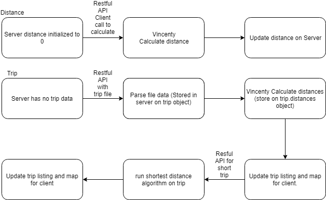
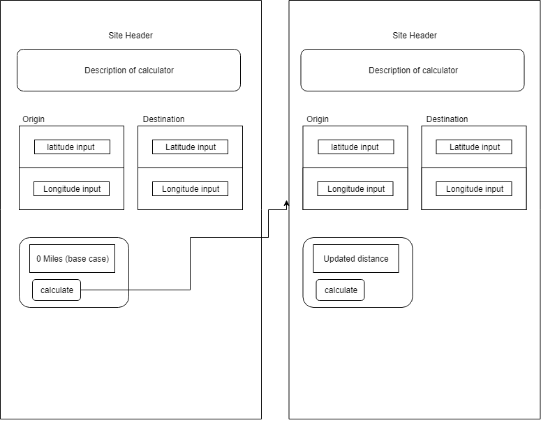
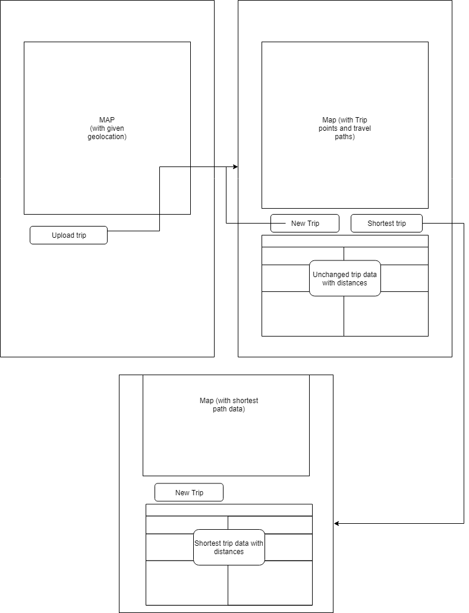

# Sprint 2 - *t20* - *Trinity+*

## Goal
### A map and itinerary! 
### Sprint Leader: *Conor Hart*

## Definition of Done

* Version in pom.xml should be `<version>2.0.0</version>` for your final build for deployment.
* Increment release `v2.0` created on GitHub with appropriate version number and name.
* Increment deployed for testing and demonstration on SPRINT2 assignment.
* Sprint Review and Restrospectives completed (team/sprint2.md).

## Policies

#### Mobile First Design!
* Design for mobile, tablet, laptop, desktop (in that order).
* Use ReactStrap for a consistent interface (no HTML, CSS, style, etc.).
* Must adhere to the TripCo Interchange Protocol (TIP) for interoperability and testing.
#### Clean Code
* Code Climate maintainability of A or B.
* Code adheres to Google style guides for Java and JavaScript.
#### Test Driven Development
* Write method headers, unit tests, and code in that order.
* Unit tests are fully automated.
#### Configuration Management
* Always check for new changes in master to resolve merge conflicts locally before committing them.
* All changes are built and tested before they are committed.
* All commits include a task/issue number.
* All commits include tests for the added or modified code.
* All tests pass.
#### Continuous Integration / Delivery 
* Master is never broken.  If broken, it is fixed immediately.
* Continuous integration successfully builds and tests all pull requests for master branch.
* All Java dependencies in pom.xml.  Do not load external libraries in your repo. 

## Plan

This sprint will complete the following Epics.

* *#0 Where am I?: Show on the homepage map where the current user is located*
* *#1 Vincenty: Take two latitude/longitude points and calculate the distance between them*
* *#2 Display map and itinerary: Load an itinerary that has location name and points,
	place all of the points onto a map and calculate the distances between them.*
* *#3 Geographic coordinate validation: Coordinates that are input will be checked to see if they are valid,
	if they are not report this to the user in a convenient way for them.*
* *#4 Geographic coordinate formats: Be able to take any given valid coordinate format and alter it for our Vincenty calculations*
* *#5 Short trip: From an itinerary sort the trip into the shortest route, update map and itinerary with this route*

Key planning decisions for this sprint include ...

*Sprint 2 base diagram*

*Calculator diagram*

*Trip diagram*

## Metrics

| Statistic | # Planned | # Completed |
| --- | ---: | ---: |
| Epics | *6* | *5* |
| Tasks |  *15*   | *23* |
| Story Points | *30* | *25* |

We were able to successfully complete all tasks and epics from the previous sprint with ease. Based on that we believe that this should be a challenging amount of work that we can complete before the end of sprint 2.

## Scrums

| Date | Tasks closed  | Tasks in progress | Impediments |
| :--- | :--- | :--- | :--- |
| *09/17/2019* | *0* | *1* | *none* | 
| *09/18/2019* | *1* | *0* | *none* | 
| *09/20/2019* | *1* | *4* | *none* |
| *09/23/2019* | *2* | *4* | *none* |
| *09/25/2019* | *4* | *4* | *none* |
| *09/27/2019* | *6* | *4* | *none* |
| *09/30/2019* | *9* | *4* | *none* |
| *10/02/2019* | *12* | *4* | *2* |
| *10/03/2019* | *23* | *0* | *none* |

## Review (focus on solution and technology)

In this sprint, ...

#### Completed epics in Sprint Backlog 

These Epics were completed.

* #0 Where am i?: Closed on 09/27/2019 *
* #4 Geographic coordinate formats: Closed on 09/30/2019 *
* #3 Geographic coordinate validation: Closed on 10/02/2019 *
* #2 Display map and itinerary: Closed on 10/02/2019 *
* #1 Vincenty: Closed on 10/02/2019 *

#### Incomplete epics in Sprint Backlog 
These Epics were not completed.
* #5 Short trip: Put in icebox 10/01/2019 *

#### What went well
We accomplished just about every epic we set out to complete, and when the realization came that we wouldnt be able to finish the last one putting that into the icebox was a unanimous decision in the group. The homepage functions how the group now wants it to work, after a few iterations of trial and error. Original ideas of relying on a refresh button to be used in order to get things to update was fixed by using React correctly. The trip page had a similar transformation, with different ideas of what it would display. Creating a new class allowed us to ensure that coordinates passed in with a trip were easy to convert and validate. Rendering any number of markers and lines connecting a trip functions very nicely. Vincenty can now take the converted coordinates and get a correct distance between points that correlates with what most of the class and TA's were getting.

#### Problems encountered and resolutions
The first problem we ran into was understanding how react renders a page based on state changes. We worked together on 
researching and figuring out how it does actually work to use it correctly with our map updating it's location. The next 
problem was being uncertain with the results that Vincenty was calculating. Upon investigation we learned that 
it was truncating the result instead of rounding and the function was using the wrong atan() function that would return
negative results on certain latitude and longitude instances. After fixing these we then worked with the rest of the class
on what results they were getting as well as the TA's calculation results to make sure we were in line with them. The final
big issue we ran into is how the client and server communicate. It took our group a while of trial and error before we had a 
breakthrough and had the trip calculate all of the distances correctly.

## Retrospective (focus on people, process, tools)

In this sprint, ...

#### What we changed this sprint

One main change this sprint was giving a larger chunk of time to the planning phase to create tasks based off the epics
and to get a better understanding of everything that needed to be completed. Another change was starting earlier on the first few 
epics to ensure that we at least knew what these epics would entail. We also utilized the github/version control process more 
effectively then last sprint.

#### What we did well

We communicated very well on what each person was currently working on and what issues they were having with their current task.
If someone was having trouble with their current task then at least one person would step up to help them out. Everyone was flexible with the tasks that we working through. If a task needed to change hands to someone else it was never a big deal on who was working on what, only that everyone was working on something. When a hurdle did come up with different peoples scheduling there were no issues in everyone being flexible with everyone else. 

#### What we need to work on

One improvement we can make is on the process of test driven development. At the start of this sprint we all started out writing
the code first without creating the methods and then tests before that. We also could have dedicated more time in the planning phase
with creating enough tasks for each epic. Having a better understanding of what each epic entails and what the code looks like will 
give us enough information to create the correct amount of tasks. We could also improve on reading the guide that is posted for the 
sprint as a few of the issues we ran into could of been solved by going through this more thoroughly. Finally using the github/zenhub
tools in a more efficient manner. This coincides with planning better as well but having more tasks that breakdown each epic more and then when someone is working on this task, placing it into in progress and making small incremental commits for the task. Our tasks 
were too large to have small commits go along for most of them, a lot of our commits were pretty big changes to the code.

#### What we will change next sprint 

Next sprint now that we have a better understanding of test driven development we will utilize this correctly in starting out whatever
task we are going to work on. We will also dedicate even more time then we did this last sprint in the planning phase to get a better idea of what each epic will include. Also we will look at any information that is given to us about the sprint more thoroughly, so we don't run into any issues that could be avoided. The final change we will make next sprint after planning things out correctly will be 
to do small incremental changes and commits for each task. Next sprint we will focus more on splitting from the pairs we have been focused in and work with the other team members more.
