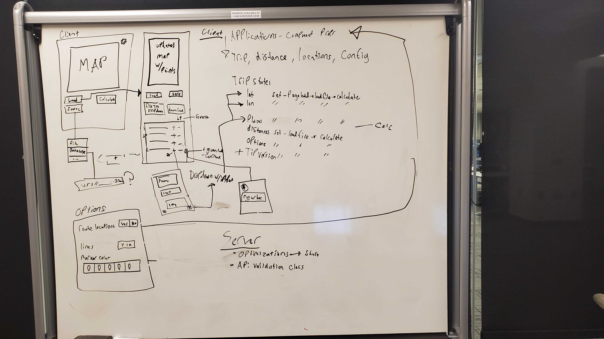

# Sprint 3 - *t20* - *Trinity+*

## Goal

### Shorter trips to more places!
### Sprint Leader: *Jonathan Quirk*

## Definition of Done

* Version in pom.xml should be `<version>3.0</version>` for your final build for deployment.
* Increment release `v3.0` created on GitHub with appropriate version number and name.
* Increment `server-3.0.jar` deployed for testing and demonstration on SPRINT3 assignment.
* Sprint Review, Restrospective, and Metrics completed (team/sprint3.md).

## Policies

#### Mobile First Design!
* Design for mobile, tablet, laptop, desktop (in that order).
* Use ReactStrap for a consistent interface (no HTML, CSS, style, etc.).
* Must adhere to the TripCo Interchange Protocol (TIP) for interoperability and testing.
#### Clean Code
* Code Climate maintainability of A or B.
* Code adheres to Google style guides for Java and JavaScript.
#### Test Driven Development
* Write method headers, unit tests, and code in that order.
* Unit tests are fully automated.
* Code Coverage above 40%
#### Configuration Management
* Always check for new changes in master to resolve merge conflicts locally before committing them.
* All changes are built and tested before they are committed.
* All commits include a task/issue number.
* All commits include tests for the added or modified code.
* All tests pass.
#### Continuous Integration / Delivery 
* Master is never broken.  If broken, it is fixed immediately.
* Continuous integration successfully builds and tests all pull requests for master branch.
* All Java dependencies in pom.xml.  Do not load external libraries in your repo. 

## Plan

This sprint will complete the following Epics.

* #154 tip v3: The server must support the TIP version 3 specification.
* #85 short trip: Rearrange trip to have shorter travel time.
* #155 save trip: Allows saving of trip to a file in different formats.
* #156 api validation: Validate all api requests given to the server.
* #157 modify trip: Allow for modification of a trip in several ways.
* #158 map clutter: Add options for map appearance.

*Sprint 3 diagram*

* Client interface: 
  * Trip page:
    * We plan on using a drop-down selector to allow for the user to choose where to load a file from.
    * Once a trip is in place we will have options to choose a file type to download in a drop-down menu.
    * Each entry in the itinerary will have a + and - next to it which will allow to add an entry after it or remove the current location.
    * The location addition button (+) will open a drop-down menu with input fields for name, latitude, and longitude.
    * Each entry will have a move button that will open a drop-down type menu where the user can choose where to move this entry to in the trip.
    * There will be a button at the top of the itinerary that will reverse the order of the given list,
  * Options page:
    * Will have options that will be stored in props for map rendering settings (lines, markers, marker colors)
    * To not crowd the props information we may want to make this a dropdown menu on the trip page instead.
* Server changes:
  * Allow for trip requests to handle optimizations (primarily short trip at this point.)
  * Api validation class that can be called by all of the API handling classes to check the validity of requests and help return correct error codes.

## Metrics

| Statistics | Planned | Completed |
| --- | ---: | ---: |
| Epics | 6 | 5 |
| Tasks |  19  | 30 | 
| Story Points |  34  | 35 | 

## Scrums

| Date | Tasks closed  | Tasks in progress | Impediments |
| :--- | :--- | :--- | :--- |
| 10/7/2019 | 0 | 1 | 0 | 
| 10/9/2019 | 2 | 2 | 1 |
| 10/11/2019 | 3 | 3 | 1 |
| 10/14/2019 | 3 | 3 | 1 |
| 10/16/2019 | 9 | 4 | 1 |
| 10/18/2019 | 13 | 4 | 1 |
| 10/21/2019 | 20 | 4 | 0 |
| 10/23/2019 | 25 | 2 | 0 |
| 10/24/2019 | 27 | 0 | 0 |

## Review (focus on solution and technology)

In this sprint, ...

#### Completed epics in Sprint Backlog 

These Epics were completed.

* *## tip v3: Closed on 10/23/19*
* *## Short Trip: Closed on 10/16/19*
* *## Save Trip: Closed on 10/16/19*
* *## API Validation: Closed on 10/23/19*
* *## Modify Trip: Closed on 10/24/19*

#### Incomplete epics in Sprint Backlog 

These Epics were not completed.

* *## Map Clutter: Midterms, Put in icebox 10/21/19*

#### What went well

Overall, the sprint went pretty well considering some of the things the team dealt with throughout the sprint. Thankfully Conor and Jonathan were able to really help out while Benny and I were working on midterms. We finished almost every epic we planned to other than Map Clutter which we all easily decided needed to go into the icebox until next sprint so that we could focus on wrapping everthing up and getting it working on black-bottle. The Short Trip, Save Trip and Modify Trip epics went the smoothest with very few hiccups along the way. We were able to get short trip calculating correctly and in a reasonable amount of time. Save trip successfully downloads either a JSON or CSV file containing the trip that the user created, this is in the same format as our itinerary to maintain consistency. Finally, all of the requested features were add to modify trip so that the user can customize or edit the trip they created with a decent amount of options.

#### Problems encountered and resolutions

The one of the main issues we dealt with was the JSON schemas. We hadn't looked at them until they were supposed to be used and in order to get things working we had to modify a decent amount of our code in order to comply with what the schemas were requesting. This kept us a little hungup on the API Validation epic and definitely slowed us down a little. Along with this we ran into where the schema files could be accessed locally and on Travis, but black-bottle could not find them. We altered they way the code looked at the files, so now it will work anywhere. Another issue was short trip in the first go around used Arraylists for everything and didn't create a multiple choices of a starting point. This had to be rewritten in order to meet these requirements. Finally we had issues with requests/responses being sent back and forth being validated correctly. We learned that in certain spots the schema was incorrect, or the server was sending extra junk along with the response body and had to change all of that. 

## Retrospective (focus on people, process, tools)

In this sprint, ...

#### What we changed this sprint

Our changes for this sprint included more planning, an earlier start and a little more communication. This sprint we sat down for planning without a decided end time. We took the time to really discuss what each epic would require and broke them down into tasks we believed to be around 1-3 story points, this definitely helped keep us on track when midterms hit and we had a hard time getting work done. We also started on the work a lot earlier this sprint, last sprint we took about the first week to plan and relax instead of just jumping in and doing some work but this sprint we started working right after we finished the planning, which again was a reason that we were able to be successful even with midterms. We also talked a lot more when it came to asking for help which was great. When someone got held up or had an issue, they weren't afraid to reach out and ask for help from a fellow team member.

#### What we did well

We did a great job at asking for help when we needed it. If one of us was having an issue, the others would step up and help out the best they could to try and resolve the problem. We have done this before but this sprint was a little more difficult and we definitely had to ask eachother for help figuring things out. We also did a great job juggling midterms with the workload from this class. We all had midterms and even though some of us were busy sometimes, the others did an incredible job being flexible and helping out where they could. We also did a great job planning and breaking down epics. We had to add some tasks as we went but thats to be expected because not everything can be planned for. 

#### What we need to work on

We could improve our estimation abilities when it comes to what tasks are going to take and how much work an epic could take. We definitely got better at it this sprint but we still underestimated a couple of epics and get held up on them because of the unexpected work load. For testing we heavily relied on running everything locally and pull requests being checked by travis. Running a version on black-bottle as well could catch things we might miss.

#### What we will change next sprint 

Next sprint we will have to dedicate even more time to the planning phase in order to not miss anything. We did a better job last sprint but still were left with some uncertaintys in the end. We will create a better plan of epics/tasks from this so as we move along with the sprint it flows smoother. Next sprint people's schedules for midterms will be less stressfull, so more people from the group can get working on their parts sooner to catch any issues ahead of time. Next sprint we will also be more strict on testing, nothing merged without someone thoroughly testing their build in a different environment. Along with this every couple of days we are going to upload the current master to black-bottle to ensure it will run in that environment, we waited until towards the end and ran into issues.
