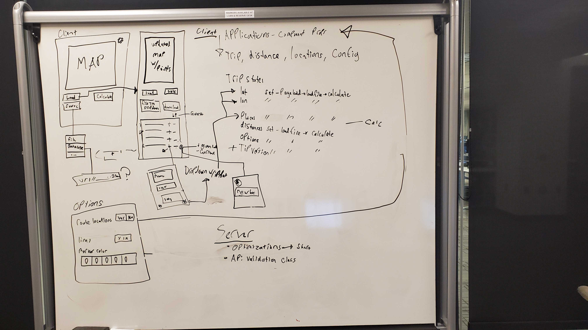

# Sprint 4 - *t20* - *Trinity+*
## Goal

### New units, faster trips and support for worldwide locations!
### Sprint Leader: *Hunter Sullivan*

## Definition of Done

* Version in pom.xml should be `<version>4.0</version>` for your final build for deployment.
* Increment release `v4.0` created on GitHub with appropriate version number and name.
* Increment `server-4.0.jar` deployed for testing and demonstration on SPRINT4 assignment.
* Sprint Review, Restrospective, and Metrics completed (team/sprint4.md).

## Policies

#### Mobile First Design!
* Design for mobile, tablet, laptop, desktop (in that order).
* Use ReactStrap for a consistent interface (no HTML, CSS, style, etc.).
* Must adhere to the TripCo Interchange Protocol (TIP) for interoperability and testing.
#### Clean Code
* Code Climate maintainability of A (Technical Debt Ratio <= 5).
* Code adheres to Google style guides for Java and JavaScript.
#### Test Driven Development
* Write method headers, unit tests, and code in that order.
* Unit tests are fully automated.
* Code Coverage above 50%
#### Configuration Management
* Always check for new changes in master to resolve merge conflicts locally before committing them.
* All changes are built and tested before they are committed.
* All commits include a task/issue number.
* All commits include tests for the added or modified code.
* All tests pass.
#### Continuous Integration / Delivery 
* Master is never broken.  If broken, it is fixed immediately.
* Continuous integration successfully builds and tests all pull requests for master branch.
* All Java dependencies in pom.xml.  Do not load external libraries in your repo. 

## Plan

This sprint we will complete the following Epics.

* *#0 TIP v4*: Update request/responses to version 4.
* *#1 Worldwide*: Update trip interface to accomodate worldwide trips
* *#2 Shorter Trip*: Implement the 2opt alogoritm to shorten trips
* *#3 Map Clutter*: Add the options to remove clutter from the map
* *#4 Distance Units*: Add more options for units
* *#5 Save Map*: Add the ability to save the map in 2 different file formats

***(Include a discussion of your plan with key diagrams here and remove this!)***

## Metrics

| Statistic | # Planned | # Completed |
| --- | ---: | ---: |
| Epics | *7* | *6* |
| Tasks |  *16*   | *34* | 
| Story Points |  *30*  | *37* | 

## Scrums

| Date | Tasks closed  | Tasks in progress | Impediments |
| :--- | :--- | :--- | :--- |
| 10/28 | 2 | 3 | 0 | 
| 10/30 | 2 | 4 | 0 | 
| 11/1 | 4 | 4 | 0 | 
| 11/4 | 0 | 4 | 0 | 
| 11/6 | 4 | 4 | 1 |
| 11/8 | 5 | 4 | 1 |
| 11/11 | 10 | 4 | 2 |
| 11/13 | 4 | 3 | 1 |
| 11/14 | 3 | 0 | 1 |

## Review (focus on solution and technology)

In this sprint, ...

#### Completed epics in Sprint Backlog 

These Epics were completed.

* *#0 TIP v4*: Update request/responses to version 4.
* *#1 Worldwide*: Update trip interface to accomodate worldwide trips
* *#2 Shorter Trip*: Implement the 2opt alogoritm to shorten trips
* *#3 Map Clutter*: Add the options to remove clutter from the map
* *#4 Distance Units*: Add more options for units

#### Incomplete epics in Sprint Backlog 

These Epics were not completed.

* *#5 Save Map*: Add the ability to save the map in 2 different file formats

#### What went well

This sprint went pretty well. We were able to complete almost all of the epics that we set out to with the exception of Save Map. We think this was mostly due to the inspections as they were definitely an impediment this sprint, but more on that later. Most of the epics went fairly smooth, Shorter Trip took a little while to complete but that was because Benny pretty much had to re-write our entire nearest neighbor function so that is understandable. Also, adding the support for the wrap around map was a little tricky and took a little too much time but we were able to get it working and looking nice on the site. The api is updated to support TIP v4 including the new formatting for locations and config and we can now support worldwide trips with a lot more customization for the map styling and units that can be used (added support for nautical miles). Without a doubt, this sprint went fairly smooth. 

#### Problems encountered and resolutions

The main issues we had revolved around only a couple things. Wrap around map took a little bit too long because we decided to use a leaflet map instead of the google maps api which inherently supports wrap around maps and leaflet has to be done manually. The shorter trip epic took a while to complete due to the complexity of the nearest neighbor function but thankfully it was able to be completed and works great. The biggest problem/impediment however, was the inspections. Those added about 10 or so issues that all had to be taken care of by the end of the sprint which was basically adding 2-3 new epics into the fold mid sprint. Thankfully, Benny reworking nearestNeighbor took care of a handful of them and the others Conor and Jon stepped up and cranked those all out in almost a day and we were able to get back on track and finish up the sprint successfully.

## Retrospective (focus on people, process, tools)

In this sprint, ...

#### What we changed this sprint

Our changes for this sprint mostly just included improving our planning phase, which we did. We had most of the tasks pretty nailed down after getting together once and really discussing how everything worked. We barely had to add any tasks mid sprint, aside from inspections, and we were very accurate on what needed to be completed for each epic. Everyone was available from the start to begin working on the project, less exams got in the way this time around. Other than that, we didn't really change too much.

#### What we did well

We worked together well and helped eachother when we needed it. For example, Hunter was having issues with wrap around and when he reached out for help, everyone started throwing out useful suggestions that all could have been a way to solve the issue. We also did a good job at managing the workload and staying on track when it came to tasks completed. At the halfway point we were exactly halfway done with our tasks which reaffirms that we did a lot better on the planning phase. When we reached the final week this time we had less in the backlog then any of the sprints before this, which allowed us to do much more testing and fixing bugs for the last few days rather than putting in new features.

#### What we need to work on

We could improve how we split up the workload. We do a great job at planning and breaking down epics but not at understanding what will take the most work and how to spread that evenly between the group. So sometimes one or two of us get stuck with a task that was a lot more than expected and that person gets a little behind on the contribution to the project. 

#### What we will change next sprint 

Next sprint, we will try to pay a little more attention to the estimation part of the planning phase. This is most likely the core issue that causes us to get stuck on larger tasks so when we break down epics, we will take a deeper look at the tasks we've broken them into and make sure we put an appropriate estimate on the number of story points its worth. That way, we know when someone might have to take a little extra time on something and can work around it. We will also work on cleaning up some of our files, several have grown large and are difficult to maintain in their current state, especially if anything needs to be added to them. Other than that, there isn't a huge amount for us to change. Things are running smoothly and we are reaching our goals for what to complete each sprint. Don't fix whats not broken right?
